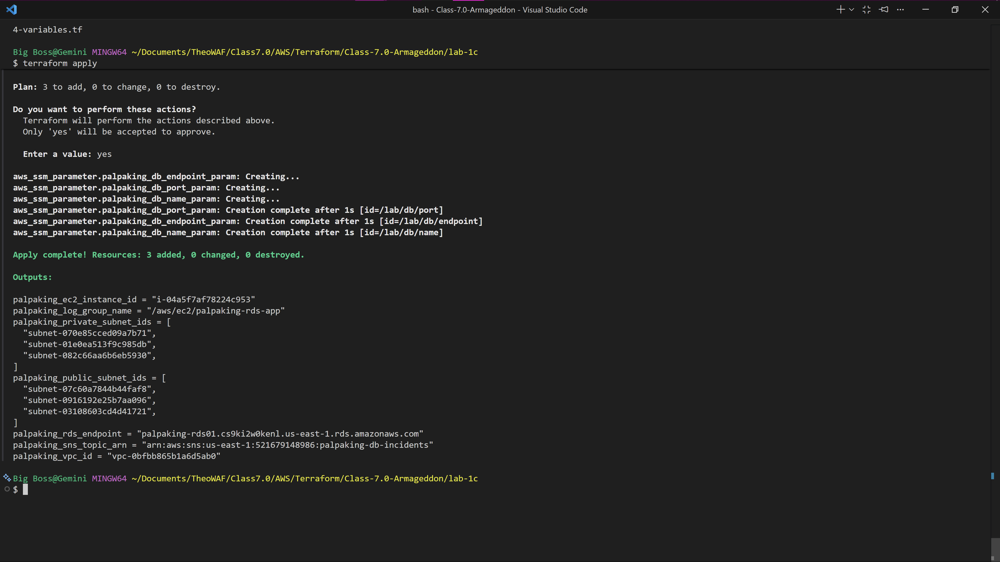
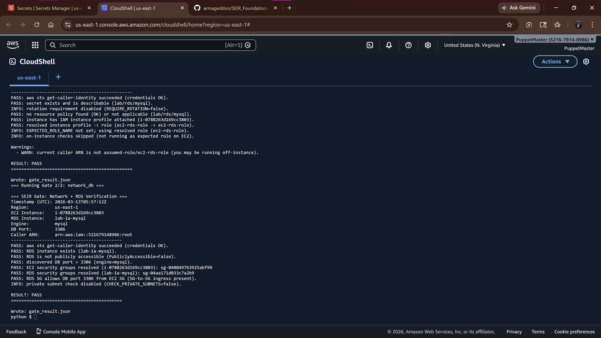
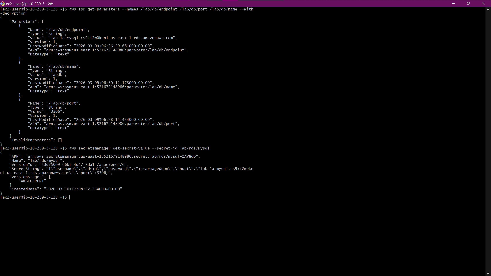
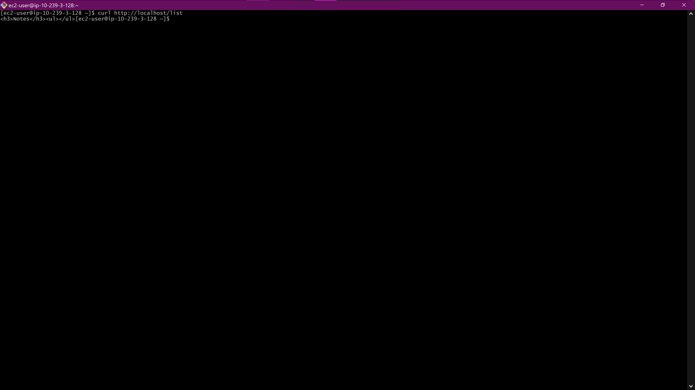
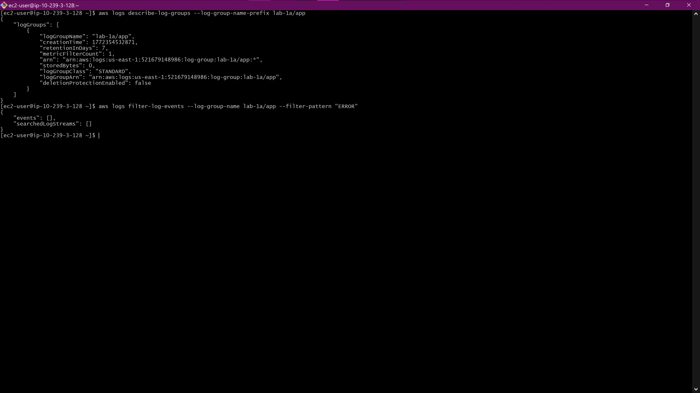
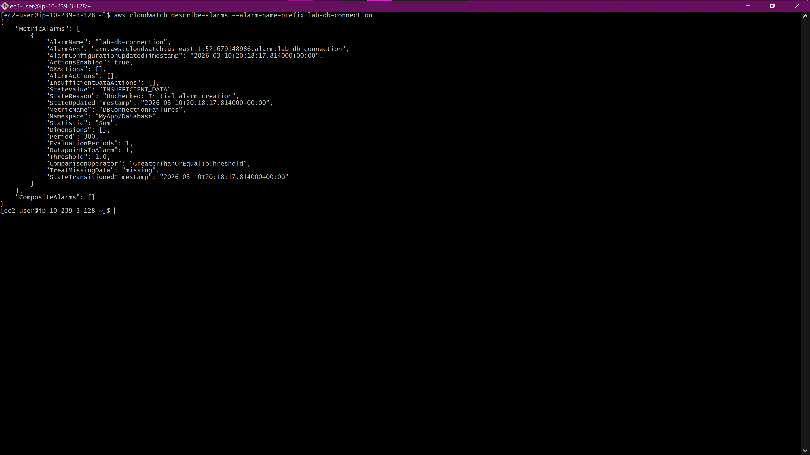

# Lab 1 (A-C): Foundational AWS Web Architecture & Database Integration 🏗️

## Overview
This project demonstrates the manual configuration and deployment of a secure, highly available, two-tier web application architecture on AWS. The environment was built from scratch utilizing a custom Virtual Private Cloud (VPC), a public-facing web server (EC2), and a private, secure backend database (RDS). 

A core focus of this lab is **security and least-privilege access**. Instead of hardcoding database credentials into the application code, the credentials are encrypted and stored in AWS Secrets Manager. The EC2 instance securely retrieves these credentials at runtime using an assigned IAM Role and custom inline policies.

## Architecture & Technologies Used
* **Amazon VPC:** Custom network encompassing `10.239.0.0/16`, utilizing 3 Availability Zones with a mix of public and private subnets, managed via an Internet Gateway and a Regional NAT Gateway.
* **Amazon EC2:** Amazon Linux 2023 (`t3.micro`) web server deployed in a public subnet, bootstrapped dynamically via a `user_data.sh` script to install dependencies and run the application.
* **Amazon RDS:** Managed MySQL 8.4.7 database (`db.t3.micro`) deployed securely without public access.
* **AWS Secrets Manager:** Securely stores and manages the RDS master credentials (`lab1a-rds-mysql`).
* **AWS IAM:** Custom role (`ec2-rds-role`) with attached inline JSON policies allowing the EC2 instance to read specifically designated secrets.
* **Security Groups:** * **Web SG:** Allows inbound HTTP (80) globally and SSH (22) restricted to a specific administrator IP.
  * **Database SG:** Strictly limits inbound MySQL (3306) traffic to originate *only* from the Web Security Group.

## Key Features & Implementation
1. **Infrastructure Provisioning:** Built a custom networking backbone (VPC, Subnets, Gateways) to isolate backend resources from the public internet.
2. **Dynamic Bootstrapping:** Configured an EC2 User Data script that automatically injects environment variables (Region, Secret IDs) and launches a Python-based web API upon server boot.
3. **Secure Credential Injection:** The application securely fetches its database connection strings from AWS Secrets Manager using standard AWS SDKs, ensuring zero plaintext passwords exist in the application code.
4. **API Endpoints Tested:** * `/init` - Initializes the database tables.
   * `/add?note=[text]` - Writes data to the secure private database.
   * `/list` - Retrieves and displays stored database records.

## 5. Verification Evidence & Deliverables

### A. Infrastructure & Security Proof
**Objective:** Verify that the foundational compute, database, and identity layers are correctly provisioned and securely configured.

* **Infrastructure Provisioning:** Terraform output confirms the successful creation and launching of the VPC, subnets, and `lab-ec2-app` compute resources.

* **Security Group Verification (The Database Shield):** The architecture strictly enforces network isolation. Verification confirms the RDS database security group drops all traffic except inbound port 3306 requests originating specifically from the EC2 web server's Security Group.

* **IAM Role & Secrets Retrieval (Least Privilege):** The EC2 instance successfully fetches sensitive database credentials from AWS Secrets Manager and configuration data from Systems Manager (SSM). This serves as definitive proof that the `ec2-rds-role` IAM profile is successfully attached and the inline policies are granting the correct access.

*(Note: Additional verification of combined SSM and Secrets retrieval can be seen in `combined-ssm-secrets-retrieval.png`)*

### B. Application & End-to-End Data Path Proof
**Objective:** Confirm the application layer can securely initialize and communicate with the private database.

* **Database Connectivity & Logic Check:** The terminal output confirms a successful `curl` request to the `/list` endpoint. While the database was captured immediately following the `/init` command (showing a successful empty list structure `<ul></ul>`), the lack of a "500 Internal Server Error" proves the Python API successfully fetched the secret, authenticated with RDS, and queried the table.

### C. Observability & Monitoring Proof
**Objective:** Ensure the environment is instrumented for rapid incident response and troubleshooting. Also, a Standard SNS Topic was provisioned and integrated with the CloudWatch Alarm to ensure immediate email notification upon database connectivity failure."

* **Log Aggregation:** The CloudWatch Agent on the EC2 instance is successfully streaming application logs (`/var/log/rdsapp.log`) to the designated CloudWatch Log Group.

* **Proactive Alarming:** A CloudWatch Alarm is properly configured to monitor the logs for the specific `ERROR` keyword, which was critical in detecting the database connectivity failure outlined in the Incident Report below.

---

## 🚨 Incident Report: Database Connectivity Failure

* **What failed?** The production application was intermittently failing and returning a "500 Internal Server Error" when users tried to access the `/list` endpoint. The application was completely unable to reach the RDS database.

* **How was it detected?** The failure was detected via CloudWatch Logs (which captured the database connection `ERROR` tracebacks in `/var/log/rdsapp.log`) and a CloudWatch Alarm (`lab-db-connection`) configured to trigger when DBConnectionFailures reached the threshold.

* **Root cause:** Network Isolation. The RDS Database Security Group was manually modified, and the inbound rule allowing TCP traffic on Port 3306 from the EC2 instance's Security Group was removed. This blocked all network traffic between the web server and the database.

* **Time to Recovery (MTTR):** *Approximately 35 minutes from initial investigation to restoring connectivity.*

### 🛡️ Preventive Actions
* **To reduce MTTR:** We should automate the deployment of our CloudWatch Alarms and CloudWatch Agent configurations using Infrastructure as Code (IaC) like CloudFormation or Terraform. During the incident, the CloudWatch Agent had stalled and the alarm was missing/unauthorized, which delayed our ability to quickly observe the logs.
* **To prevent recurrence:** Implement stricter IAM (Identity and Access Management) policies or AWS Config rules to prevent unauthorized users from modifying or deleting critical Security Group rules in the production environment.

---

## 📝 Lab Deliverables: Q&A

**A) Why is the DB inbound source restricted to the EC2 security group?**
By referencing the EC2 Security Group ID instead of an IP address or CIDR block, we ensure that only compute resources dynamically assigned to the web tier can communicate with the database. It prevents direct access from the public internet or other unauthorized subnets, establishing a strict zero-trust boundary.

**B) What port does MySQL use?**
MySQL communicates over **TCP Port 3306**.

**C) Why is Secrets Manager better than storing creds in code/user-data?**
Hardcoding credentials in code or user-data exposes plaintext passwords in version control (GitHub) or EC2 instance metadata. Using AWS Secrets Manager encrypts the credentials at rest, allows for automated key rotation, and enforces IAM least-privilege access at runtime (meaning the server has to authorize itself to fetch the password).

---

### Deliverable 3: CLI Audit Evidence (JSON Outputs)
As required for technical verification, the following JSON files contain the direct AWS CLI outputs confirming the state and configuration of the infrastructure prior to teardown:

* [EC2 Instance Verification](./ec2-verification.json)
* [IAM Role Attachment](./iam-role.json)
* [RDS Instance State](./rds-state.json)
* [RDS Endpoint Verification](./rds-endpoint.json)
* [Security Group Rules (Port 3306 Restricted)](./sg-rules.json)

---

🧠 Lab 1b: Operations & Reflection
A) Why might Parameter Store still exist alongside Secrets Manager?
Parameter Store is often used for non-sensitive configuration data (like hostnames, feature flags, or environment variables) because it is cost-effective and provides a simple hierarchical structure. Secrets Manager is specifically designed for sensitive credentials that require high-security features like built-in lifecycle management and automated rotation. Using both allows an organization to balance cost with high-end security.

B) What breaks first during secret rotation?
Typically, the application connection breaks first. If a secret is rotated in AWS Secrets Manager but the application is still using a cached version of the old password, it will receive a 403 Access Denied or Connection Refused error. This is why applications must be designed to "retry" a fetch from Secrets Manager if they encounter a credential failure.

C) Why should alarms be based on symptoms instead of causes?
Symptoms (like a 500 Internal Server Error or a high error count in logs) tell you that the user experience is degraded, which is what matters most. A "cause" (like a specific security group rule being deleted) might not always result in a failure if there is redundancy. By alerting on symptoms, you ensure you are paged for every actual outage without being overwhelmed by "noise" from non-critical configuration changes.

D) How does this lab reduce mean time to recovery (MTTR)?
This lab reduces MTTR by providing Observability. Instead of manually hunting through the AWS Console to guess why the app is down, the CloudWatch Alarm and Log Filter point the engineer directly to the error (e.g., "Access Denied to RDS"). Combined with storing configuration in Parameter Store, the engineer can restore service using known-good values immediately.

E) What would you automate next?
The next logical step is to move from manual configuration to Infrastructure as Code (IaC) using Terraform or CloudFormation. Automating the deployment of the CloudWatch Alarms and the Security Group rules would prevent the "manual drift" that caused the incident in this lab, effectively preventing the failure before it even happens.

## Teardown & State Management
To manage cloud costs, active compute and networking resources (EC2, RDS, NAT Gateway, VPC) were terminated at the conclusion of the lab. Persistent identity and security configurations (IAM Roles, Secrets Manager entries) were retained for integration into subsequent infrastructure-as-code deployments.