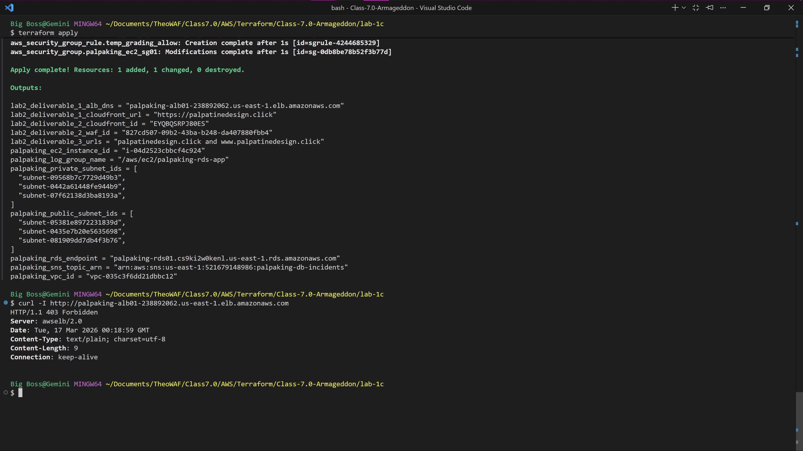
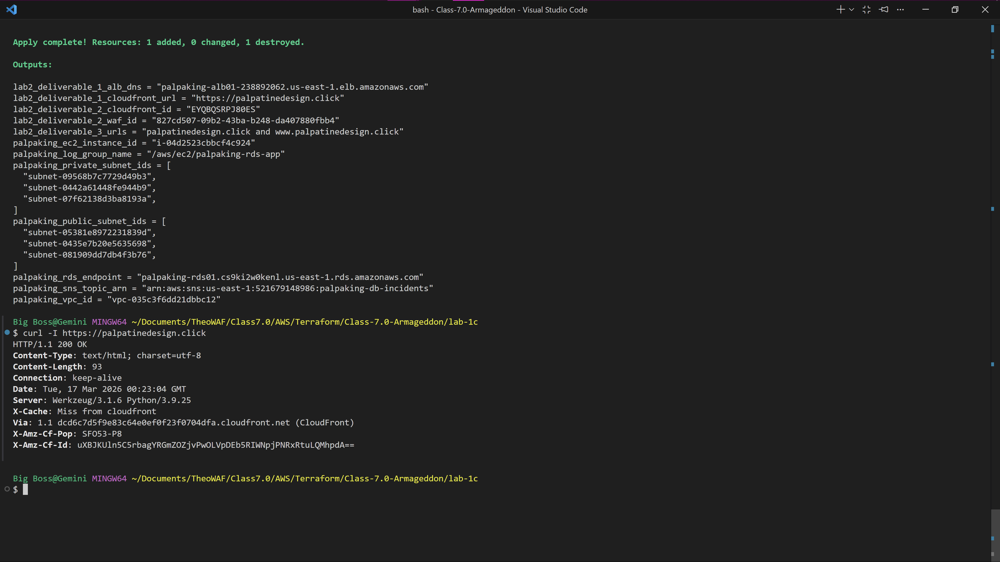
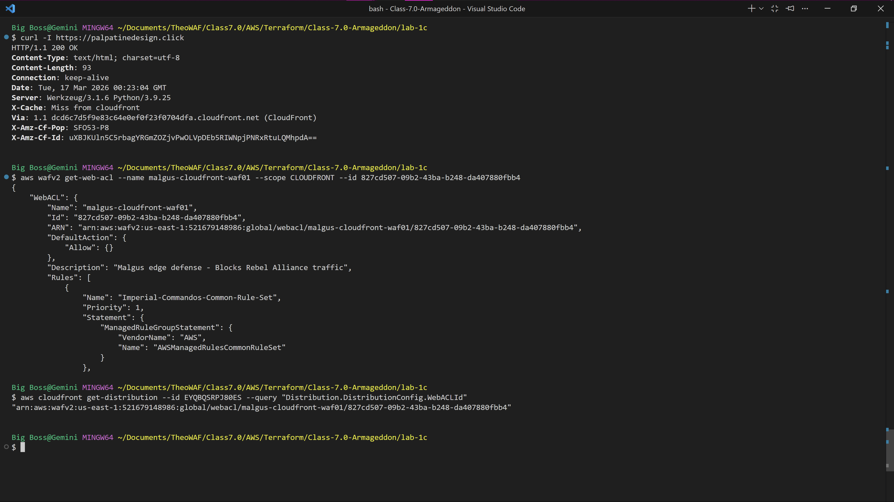
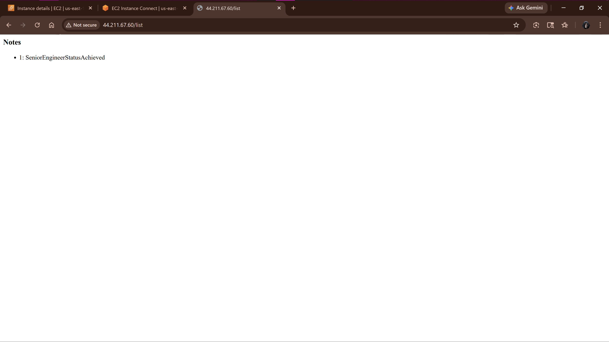

# Lab 2A: Global Edge Delivery & Advanced Origin Cloaking 🛡️

## Overview
This document contains the verification evidence for the deployment of a highly secure, global content delivery architecture. The infrastructure utilizes an Application Load Balancer (ALB) and perfectly "cloaks" the origin servers. All public internet traffic is forced through a secure AWS CloudFront CDN protected by AWS WAF, preventing any direct access to the backend EC2 instances.

## 1. Verified Origin Cloaking (The Inner Shield)
The architecture uses custom HTTP headers (`X-Chewbacca-Growl`) and strict Security Group rules to drop any traffic that does not originate from the CloudFront CDN.
* **Evidence (Direct ALB Access - Blocked):** A direct `curl` request to the Application Load Balancer is successfully rejected with an `HTTP 403 Forbidden` response, proving the origin is cloaked.

* **Evidence (CloudFront Access - Allowed):** A `curl` request routed properly through the CloudFront custom domain (`palpatinedesign.click`) returns an `HTTP 200 OK`, proving the CDN is the only allowed pathway.

## 2. WAF Integration & Edge Defense
To protect against common web exploits, an AWS WAF WebACL ("Malgus edge defense") is attached directly to the global CloudFront distribution.
* **Evidence:** AWS CLI queries successfully return the WAF's Amazon Resource Name (ARN) and confirm its active attachment to the CloudFront distribution ID (`EYQBQSRPJ80ES`).

## 3. Global DNS Routing (Route 53)
Amazon Route 53 is configured to resolve the custom domain securely to the globally distributed CloudFront Edge locations.
* **Evidence:** An `nslookup` on `palpatinedesign.click` successfully resolves to the dynamically assigned `13.249.74.x` CloudFront IP addresses, confirming proper DNS routing.

## 4. End-to-End Application Verification
Confirming that the underlying web application and private database deployed in Lab 1 are successfully rendering through the new highly available edge architecture.
* **Evidence:** The browser successfully queries the database and returns the required validation string (`SeniorEngineerStatusAchieved`).

---
**Status:** Lab 2A Edge Architecture successfully provisioned, secured, and verified.