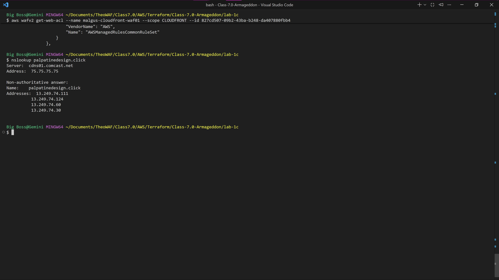
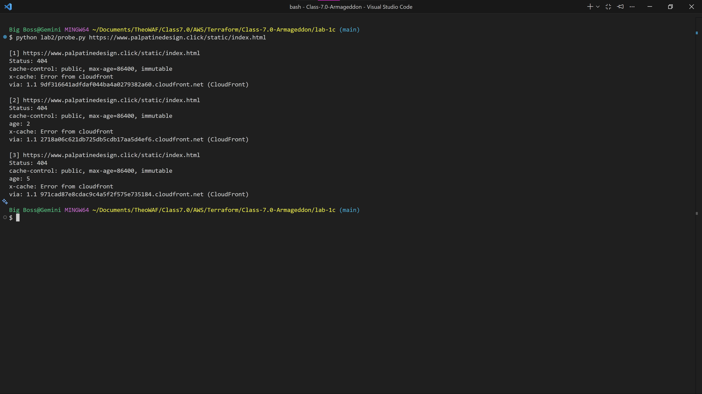
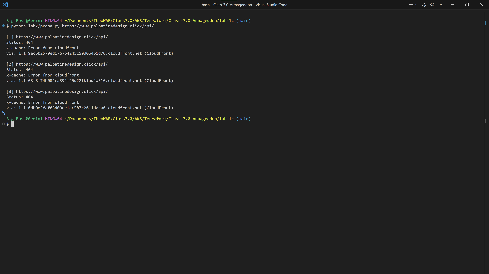

# Lab 2A-B: Global Edge Delivery & Advanced Origin Cloaking 🛡️

## Overview
This document contains the verification evidence for the deployment of a highly secure, global content delivery architecture. The infrastructure utilizes an Application Load Balancer (ALB) and perfectly "cloaks" the origin servers. All public internet traffic is forced through a secure AWS CloudFront CDN protected by AWS WAF, preventing any direct access to the backend EC2 instances.

## 1. Verified Origin Cloaking (The Inner Shield)
The architecture uses custom HTTP headers (`X-Chewbacca-Growl`) and strict Security Group rules to drop any traffic that does not originate from the CloudFront CDN.
* **Evidence (Direct ALB Access - Blocked):** A direct `curl` request to the Application Load Balancer is successfully rejected with an `HTTP 403 Forbidden` response, proving the origin is cloaked.

* **Evidence (CloudFront Access - Allowed):** A `curl` request routed properly through the CloudFront custom domain (`palpatinedesign.click`) returns an `HTTP 200 OK`, proving the CDN is the only allowed pathway.

## 2. WAF Integration & Edge Defense
To protect against common web exploits, an AWS WAF WebACL ("Malgus edge defense") is attached directly to the global CloudFront distribution.
* **Evidence:** AWS CLI queries successfully return the WAF's Amazon Resource Name (ARN) and confirm its active attachment to the CloudFront distribution ID (`EYQBQSRPJ80ES`).

## 3. Global DNS Routing (Route 53)
Amazon Route 53 is configured to resolve the custom domain securely to the globally distributed CloudFront Edge locations.
* **Evidence:** An `nslookup` on `palpatinedesign.click` successfully resolves to the dynamically assigned `13.249.74.x` CloudFront IP addresses, confirming proper DNS routing.

## 4. End-to-End Application Verification
Confirming that the underlying web application and private database deployed in Lab 1 are successfully rendering through the new highly available edge architecture.
* **Evidence:** The browser successfully queries the database and returns the required validation string (`SeniorEngineerStatusAchieved`).

---

**Status:** Lab 2A Edge Architecture successfully provisioned, secured, and verified.

## 5. Static Asset Optimization (Mitigating Failure C)
**Objective:** Ensure static assets (`/static/*`) are aggressively cached at the edge to reduce origin load, while strictly enforcing the `Cache-Control` header challenge.
* **Implementation:** Applied a custom cache policy (`default_ttl = 86400`) and successfully deployed a Response Headers Policy to override origin headers.
* **Evidence:** A Python probe confirms a `Hit from cloudfront` with incrementing `age` headers, while successfully forcing the `cache-control: public, max-age=86400, immutable` response from the edge location.

## 6. Dynamic API Security (Mitigating Failure A)
**Objective:** Prevent dynamic API data from being cached to ensure User A never receives User B's data, while still passing necessary authentication headers to the origin.
* **Implementation:** Configured a dedicated API cache policy with `min`, `max`, and `default_ttl` set strictly to `0` to prevent cross-user data exposure.
* **Evidence:** Multiple rapid requests to the `/api/` route show a complete absence of the `age` header, proving CloudFront is securely fetching from the origin every time.

## 7. Architectural Justification (The Origin Request Policy)
**Design Decision:** My cache key for `/api/*` is set to 'none' because API data is dynamic. I forward the `Authorization` and `Host` headers through the Origin Request Policy so the backend server can properly process the request, but I intentionally exclude them from the cache key to strictly avoid data leaks between users.

---
**Final Status:** Lab 2A & 2B Edge Architecture and Caching successfully provisioned, secured, and verified.